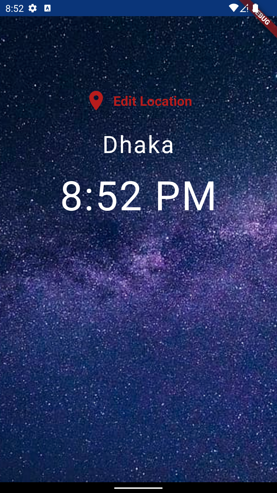
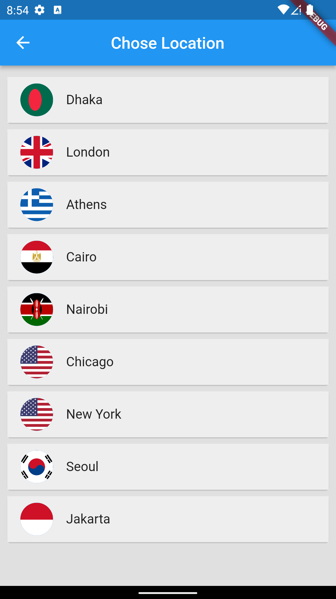
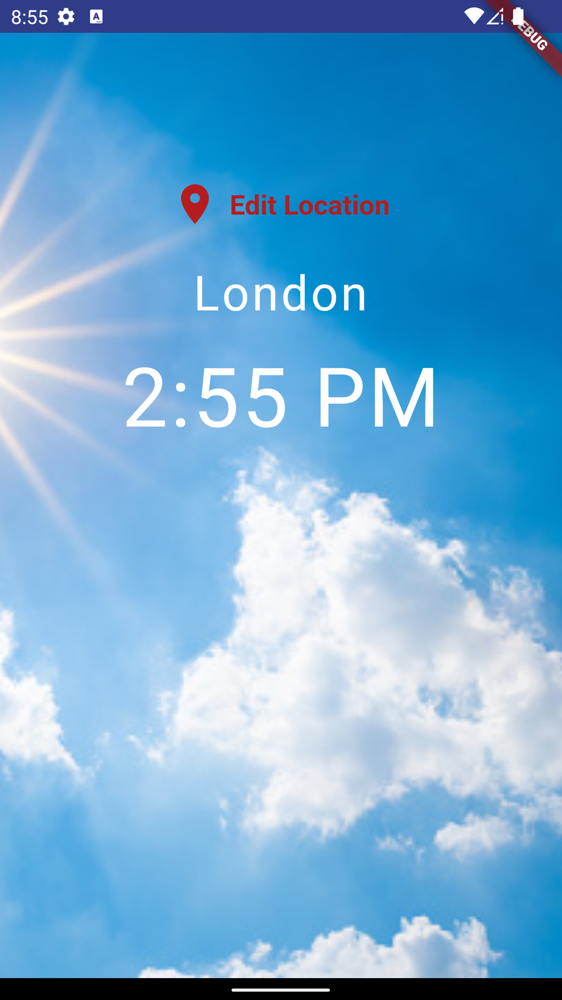

# WorldClock-Flutter
This is a personal flutter project for learning purpose.

## Components Used

* Android Studio
* [World Time API](http://worldtimeapi.org)
* Flutter
* Dart
* [Flutter Spinkit](https://pub.dev/packages/flutter_spinkit)

## Features

* [Clock](#clock)
* [Location](#location)

## TODO Features

* Time update in real time 

## Features details with screenshots

### Clock

It shows the current time of currently selected region. By default it is Dhaka, Bangladesh. Depending on day or night time background image also changes.
Time update is not in real time. It always update when selected from location list.

### Location

